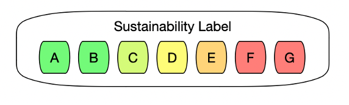
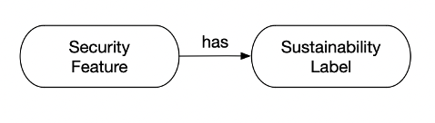
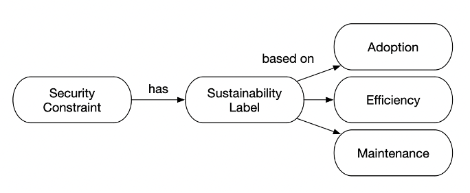
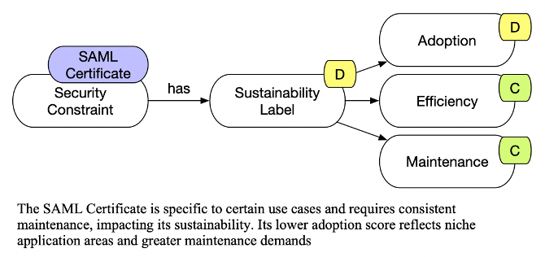

# EcoSec

## Introduction

EcoSec is a sustainability ontology designed to assess and label the sustainability impact of security mechanisms and devices throughout their lifecycle. It provides a framework for evaluating the environmental and operational sustainability of various elements.

## Purpose

EcoSec aims to systematically evaluate the sustainability of security mechanisms and devices, helping organizations make informed decisions that align with environmental and operational sustainability goals.

## Key Elements

### Sustainability Labels
Classifies the sustainability performance of devices and security mechanisms from A (most sustainable) to G (least sustainable).

### Security Features 
Connects to a minimum sustainability label, indicating the acceptable level of sustainability for associated security mechanisms.

### SecurityConstraint
Associates security mechanisms with their overall sustainability label based on adoption, maintenance, and efficiency.

Example

### Device Lifecycle
- **Raw Material**: Assesses material origin, extraction impacts, efficiency, recycled content, and hazardous substance compliance.
- **Manufacturing**: Evaluates CO2 emissions, water consumption, renewable energy usage, and waste treatment.
- **Packaging**: Focuses on material types, efficiency, and sustainability information.
- **Transport**: Assesses transport mode efficiency, logistics optimization, and transport packaging.
- **Usage**: Covers energy efficiency, durability, repairability, and software updates.
- **Spare Parts**: Evaluates availability, compatibility, and sustainability of spare parts.
- **End of Life**: Focuses on recyclability, return programs, and reusability.

